# THALAMUS — Slide Deck

---

## Slide 1 — Title

**THALAMUS: Adaptive Context Selection for AI Agents**

Subtitle: How to stop loading everything into the context window and start loading only what matters.

The name comes from the biological thalamus — the brain's relay station that filters sensory input before passing it to the cortex. Same idea: filter before forwarding.

---

## Slide 2 — The Problem: Context Saturation

Production agents load every skill, every memory section, every tool definition into the context window on every query. This is called uniform inclusion.

It works when the library is small. It breaks when the library grows.

Three things go wrong as N (number of components) increases:

1. **Attention dilution** — relevant content competes with irrelevant content for the model's finite attention. The more irrelevant text, the weaker the signal from what actually matters.

2. **Token cost scales with library size, not query complexity** — if you have 50 skills averaging 500 tokens each, every query costs 25,000 tokens in system prompt, whether 1 or all 50 skills are relevant.

3. **Noise-to-signal inversion** — when irrelevant components outnumber relevant ones (the normal case), the majority of the context window actively works against the agent.

Name for this failure: **Context Saturation**.

---

## Slide 3 — Why Query-Time Retrieval Is Not the Answer

The naive fix is RAG: embed the query, retrieve the most similar skill documents.

Two structural problems with this for agentic context:

**Problem 1 — Skills are not answers, they are instructions.** Relevance is not about text similarity between the query and the skill title. It is about whether the agent performs better when the skill is in context. A skill titled "CI Pipeline Setup" is the right skill for "automate my tests" — but a text similarity search may not know that.

**Problem 2 — Retrieval ranks documents independently.** Context selection is a set optimization problem, not a ranking problem. The right question is: which combination of components produces the best output for this query class within a token budget? Ranking ignores interactions between components and cannot reason about budget constraints jointly.

The structurally correct answer: **do the expensive reasoning offline**, then look up the result at query time.

---

## Slide 4 — THALAMUS in One Picture

Two independent paths, executed at different times:

```
PATH A — EVOLUTIONARY SELECTOR (cold start, < 500 turns):
  Stage 1 — Component Scoring       → scoring matrices (LLM-intensive)
  Stage 2 — Score Enrichment        → blend real interaction data into matrices
  Stage 3 — Query Clustering        → cluster assignments + query centroids
  Stage 4 — Evolutionary Search     → optimal configs per cluster × budget
  Stage 5 — Write Output            → context_configs.json + context_configs.pkl

  QUERY TIME: ClusterSelector           → lookup precomputed config

PATH B — CLASSIFIER PATH (data-rich, >= 500 turns):
  Turn Logging                      → turns_YYYY-WNN.jsonl
  Classifier Training               → logistic regression → classifier.pkl

  QUERY TIME: ClassifierSelector       → predict from query embedding
```
<br>

<details>
<summary>Mermaid diagram</summary>

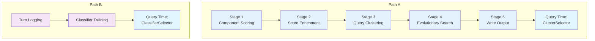

</details>


Key property: **no LLM calls at query time**. All expensive computation is front-loaded.

---

## Slide 5 — System Architecture: Four Packages

```
component_scoring/    Path A Stages 1 + 2 — scans components, runs LLM scoring, enriches with real data
oracle_builder/       Path A Stages 3–5 + Path B — evolutionary search, classifier training
context_selectors/    Query time inference — ClusterSelector, ClassifierSelector, BudgetEstimator
shared/               Utilities used by all: TurnLogger, OutcomeScorer,
                      QueryClusterer, ComponentInclusionClassifier, bookend_order
```

Strict boundary: no package imports from another package. Both `oracle_builder` and `context_selectors` import from `shared`. Neither imports the other.

Artifacts flow in two independent paths:

```
PATH A (evolutionary selector):
  component_scoring → scoring_matrix_*.json → oracle_builder (evolve)
  oracle_builder    → context_configs.json + context_configs.pkl → context_selectors (ClusterSelector)

PATH B (classifier path):
  shared (TurnLogger) → turns_YYYY-WNN.jsonl → oracle_builder (train-classifier)
  oracle_builder      → classifier.pkl → context_selectors (ClassifierSelector)

Both paths read from shared logging for their own purposes.
```

---

## Slide 6 — Path A — Evolutionary Selector in Detail

(cold start: builds from scratch, works with zero logged turns)

```

STAGE 1: COMPONENT SCORING
  Tools: any OpenAI-compatible LLM API, Python AST parser, markdown parser

  Input:  skill directories + memory markdown files + Python tool source files
  ↓
  Scan → ComponentRecord (name, description, body_text, source_path, mtime)
  ↓
  SHA-256 fingerprint (name + description + mtime) → skip unchanged components
  ↓
  For each new/changed component (in parallel, up to 5 workers):
    LLM call 1 — Query Generator
      prompt: component body → generate 20 × (query, expected_answer) pairs
      temperature: 0.8  →  diverse coverage
      filter: drop if query < 10 chars or expected_answer < 5 chars
    LLM call 2 — Evaluator (one per example pair)
      system: component body
      user: query
      → candidate_output
    Score: F1, Bigram F1, Bag-of-Words, Length Ratio (default)
           BERTScore and LLM judge available via --metrics → mean_score
  ↓
  Output: scoring_matrix_TYPE_NAME.json  (one file per component)

───────────────────────────────────────────────────────────
STAGE 2: SCORE ENRICHMENT  [optional, can repeat]
  Input:  scoring matrices + turns_YYYY-WNN.jsonl (real interaction logs)

  For each component cᵢ:
    n_real = count of logged turns where cᵢ was in context
    synthetic_weight = max(0, 1 − n_real / 100)
    updated_mean = synthetic_weight × synthetic_mean
                 + (1 − synthetic_weight) × mean(real_outcome_scores)
  ↓
  Output: scoring matrices with updated_mean_score field

───────────────────────────────────────────────────────────
STAGE 3: QUERY CLUSTERING
  Input:  all scoring_matrix_*.json files  →  N ComponentInfo objects

  Step 1: Collect all example_input texts from all matrices
  Step 2: Cluster texts
    Backend A (default): TF-IDF vectorizer (vocab=2000) + K-means (K=20)
    Backend B (optional): sentence-transformer all-MiniLM-L6-v2 + K-means (K=20)
    → K cluster centroids + cluster assignments
  Step 3: Per-component query centroid
    = mean embedding over all of that component's example_input texts

  Output: cluster assignments + clusterer saved to context_configs.pkl

───────────────────────────────────────────────────────────
STAGE 4: EVOLUTIONARY SEARCH (60 optimization targets = 20 clusters × 3 budgets)
  Input:  cluster centroids + component query centroids + mean scores

  For each (cluster k, budget tier) — 60 pairs total:
    Genetic Algorithm
      genome:     N-bit bitmask (bit[i]=1 → include component i)
      population: 100 random genomes
      fitness:    Σᵢ [mean_score_i × cosine(cluster_centroid, component_centroid_i) × bit_i]
                  − 0.1 × total_tokens / budget
      selection:  tournament (k=3)
      crossover:  uniform (bit-by-bit coin flip from either parent)
      mutation:   bit-flip at p=0.05 per position
      200 generations
      → Pareto front: non-dominated genomes by (fitness, tokens)
      [optional] LLM Pareto validation:
        per genome: LLM scores component names against cluster queries (1–10)
        combined = proxy_fitness × 0.5 + (llm_score−1)/9 × 0.5
        re-rank Pareto front by combined score
    Pick best genome within budget → sort components by relevance (most-relevant-first)

  Output: optimal configs per cluster × budget (in memory)

───────────────────────────────────────────────────────────
STAGE 5: WRITE OUTPUT ARTIFACT
  Write context_configs.json + context_configs.pkl (serialized clusterer)

  context_configs.json: optimal_configs per cluster × budget, relevance-sorted
  context_configs.pkl: fitted clusterer for query time cluster assignment

───────────────────────────────────────────────────────────
QUERY TIME — ClusterSelector (< 10 ms)
    raw query text
    → vectorize (same TF-IDF or sentence-transformer as build)
    → K-means predict → nearest cluster k
    → JSON lookup: clusters[k].optimal_configs[budget_tier]
    → apply ordering: relevance (default) | bookend | none
    → return {skills, memory, tools, fitness, context_tokens}

  Auto budget (optional):
    BudgetEstimator.estimate(query)  →  "small" | "medium" | "large"
    heuristic: word count + multi-step regex patterns

```
<br>

<details>
<summary>Mermaid diagram</summary>

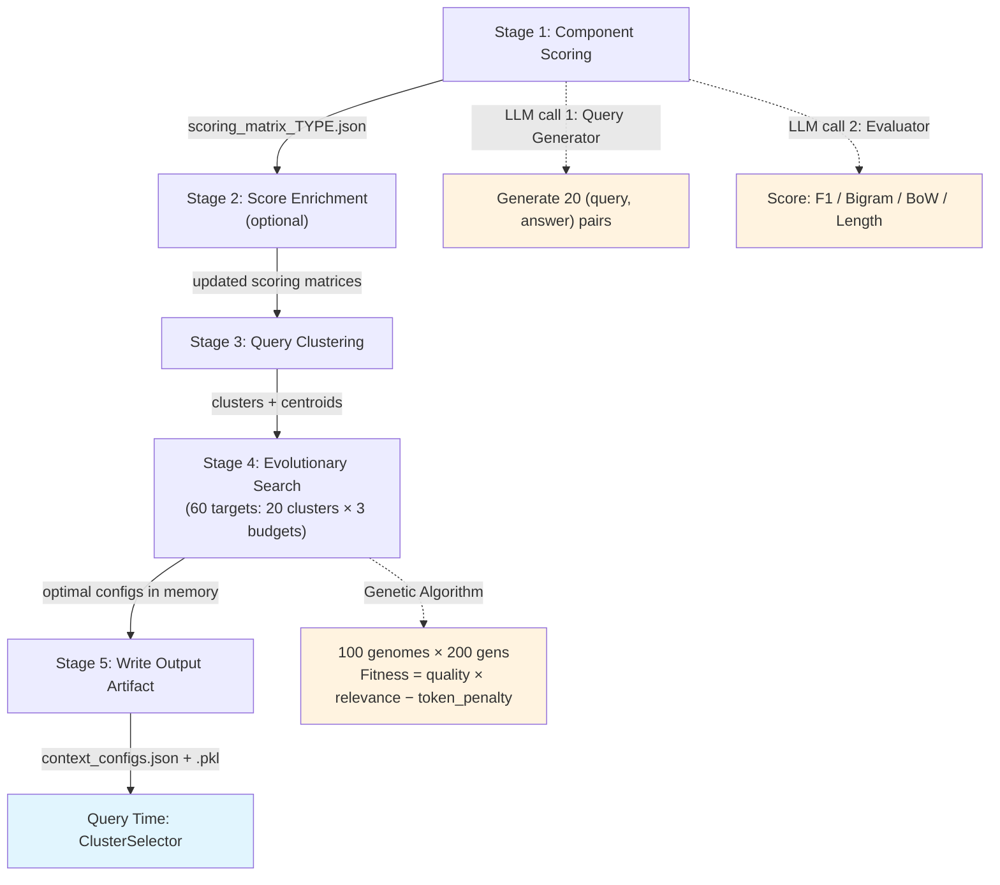
</details>

---

## Slide 7 — Path A, Stage 1: What Is a Component?

Three types of context components:

| Type | Source | One component = |
|------|--------|-----------------|
| Skill | `SKILL.md` files in subdirectories | One skill folder |
| Memory section | Markdown files split at `##` headings | One heading block |
| Tool | Python files with `Tool*` class definitions | One class |

Each component is stored as a `ComponentRecord`:
- name, description, body text (the full content), source path, modification timestamp

Change detection: SHA-256 fingerprint over (name, description, mtime). Components whose fingerprint has not changed since the last build are skipped — no re-evaluation.

---

## Slide 8 — Path A, Stage 1: Two-Step LLM Evaluation

For each component, the pipeline runs two LLM calls per example (default: 20 examples):

**Step 1 — Query Generation**

Input: component body text
Prompt: "Generate N realistic queries and expected answers for which this component would be useful"
Temperature: 0.8 (diversity)
Output: N × (query, expected_answer) pairs
Filter: drop pairs with query < 10 chars or expected_answer < 5 chars

**Step 2 — Component Evaluation**

For each (query, expected_answer) pair:
- System prompt = component body
- User message = query
- Model produces candidate output
- Score candidate output against expected_answer using 4 lexical metrics

Output: `scoring_matrix_TYPE_NAME.json` — one row per example

**Combination scoring (optional):** By default, each component is evaluated in isolation (`--eval-combination-size 1`). Set to N > 1 to evaluate the component alongside N−1 random others. This captures joint effects but costs N× more LLM calls.

<details>
<summary>Mermaid diagram — Stage 1 internal detail</summary>

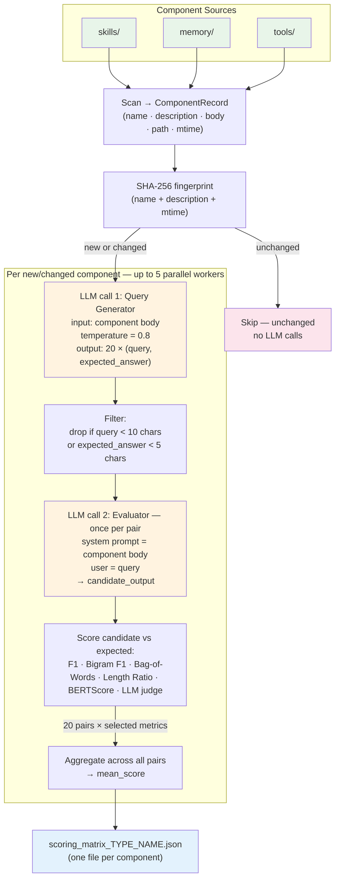

</details>

---

## Slide 9 — Path A, Stage 1: Scoring Metrics

Six metrics are available. Each measures a different aspect of candidate quality. No single metric is sufficient — combining them reduces the risk that any one bias dominates.

| Metric | What it measures | Included by default | Requirements | Strength | Weakness |
|---|---|---|---|---|---|
| F1 | Token-level precision/recall between candidate and expected output | Yes | None | Fast; widely understood | Penalizes paraphrases and different word order |
| Bigram F1 | Same as F1 but over 2-gram sequences | Yes | None | Captures short phrases better | Still surface-form based |
| Bag of Words | Word overlap ratio, order-independent | Yes | None | Better for reordered content | Ignores grammar and structure |
| Length Ratio | min(len) / max(len) | Yes | None | Penalizes drastically different lengths | No semantic signal |
| BERTScore | Embedding-based semantic similarity between candidate and expected | No | `bert-score` package | Captures paraphrases and semantic equivalence | Slower; requires model download |
| LLM judge | Direct 1–10 quality rating from an LLM | No | LLM API key | Strongest semantic signal; works when packages cannot be installed | Slower; depends on judge model quality |

**How `mean_score` is computed:**
```
mean_score = average of all selected metrics across all N example pairs
```

Select metrics with `--metrics` (comma-separated). Default: `f1,bigram_f1,bag_of_words,length_ratio`. Add semantic metrics: `--metrics f1,bigram_f1,bert_score,llm_judge`.

**Combination scoring:** `--eval-combination-size N` evaluates the component alongside N−1 random other components (instead of in isolation). This captures joint effects that isolated evaluation misses, at the cost of N× more LLM calls. Default: 1 (isolated evaluation).

Why six metrics? The evolutionary search only needs a relative ordering signal, not absolute precision. Multiple metrics from different families (lexical overlap, embedding similarity, LLM judgment) make the signal more robust against any single metric's blind spots.

<br>

<details>
<summary>Mermaid diagram — metrics computation flow</summary>

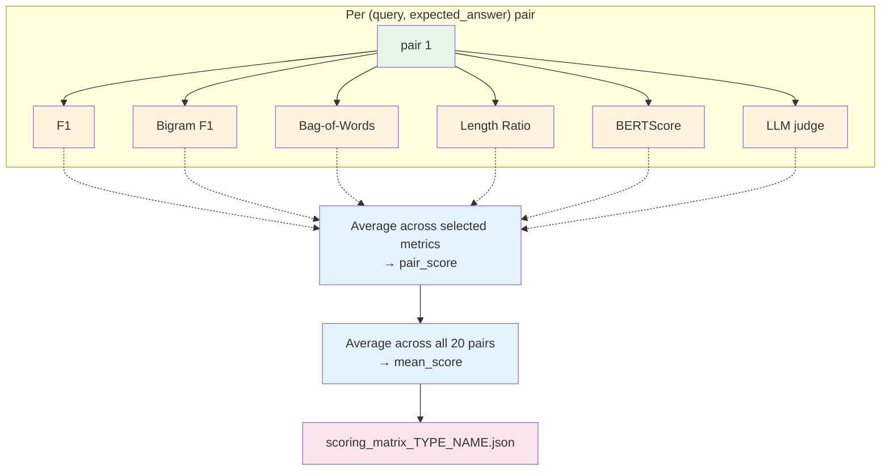

</details>

---

## Slide 10 — Path A, Stage 2: Blending Real Data (Score Enrichment)

Synthetic scores from Path A Stage 1 are an approximation — the LLM may not generate the full distribution of real queries. Path A Stage 2 corrects this as real interaction data accumulates.

**Bayesian blending formula:**

```
n_real           = number of logged turns where component c was in context
synthetic_weight = max(0,  1 − n_real / n_needed)
real_weight      = 1 − synthetic_weight

updated_mean     = synthetic_weight × synthetic_mean
                 + real_weight × mean(real_outcome_scores)
```

`n_needed` (default: 100) is the number of real turns at which the real evidence fully displaces the synthetic prior.

Behavior:
- 0 real turns → updated_mean = synthetic_mean (Path A Stage 1 score unchanged)
- 100+ real turns → updated_mean ≈ mean of real outcomes
- Between 0 and 100 → smooth interpolation

Path A Stage 2 is optional. The rest of Path A runs correctly without it.
<br>

<details>
<summary>Mermaid diagram — Bayesian blending</summary>

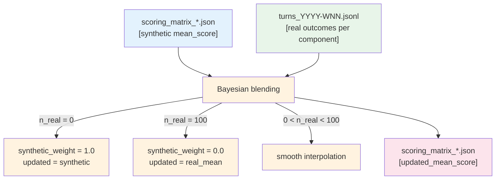

</details>

---

## Slide 11 — Path A, Stage 3: Query Space Preparation

Before searching for optimal configs, THALAMUS needs to partition the query space. It cannot optimize separately for every possible query, but it can optimize for every cluster of similar queries.

**Input:** all `example_input` texts from all scoring matrices (the queries the components were designed for)

**Two embedding backends (configurable with `--embedder`):**

| Backend | How | Strength | Weakness |
|---------|-----|----------|----------|
| TF-IDF (default) | Sparse bag-of-words vectors, 2000-feature vocabulary, K-means | Fast, no extra deps | Paraphrase-blind |
| Sentence transformer | Dense semantic vectors via `all-MiniLM-L6-v2`, unit-normalized, K-means | Paraphrase-robust | Slower, requires `sentence-transformers` package |

Default: K = 20 clusters.

**Query centroid per component:** for each component, compute the mean embedding over all its example input texts. This is the component's "center of mass" in query space — used in the fitness function during search.

The fitted clusterer is saved as `context_configs.pkl`. The same backend must be used at runtime to assign new queries to clusters.
<br>

<details>
<summary>Mermaid diagram — clustering pipeline</summary>

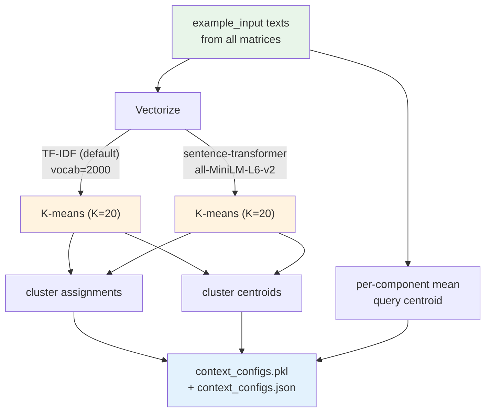

</details>

---

## Slide 12 — Path A, Stage 4: How Genetic Algorithms Work (General Explanation)

Genetic algorithms are a family of search methods inspired by how evolution works in nature. You use them when you need to find a good solution in a very large search space and cannot afford to check every possibility.

**The core idea:** instead of searching one candidate at a time, maintain a population of many candidates simultaneously and let them "compete and reproduce" across many generations. Better candidates are more likely to pass their traits to the next generation.

**Five key concepts:**

**1. Genome (representation)**
Each candidate solution is encoded as a fixed-length data structure — in GAs, typically a string of bits or numbers. Each position represents one decision. The full string encodes one complete solution.
Example: a 50-bit string where each bit means "include this component or not".

**2. Fitness function**
A function that takes one genome and returns a score — how good this solution is. The GA uses nothing else. It does not "understand" the problem, it only measures fitness. This function must be cheap to compute, because it runs thousands of times.

**3. Selection**
Higher-fitness candidates are more likely to be chosen as parents. One common method: tournament selection — randomly pick k candidates, the fittest one wins the tournament. Run this twice to get two parents. This creates pressure toward better solutions while keeping some diversity.

**4. Crossover (recombination)**
Two parents produce a child by mixing parts of both. Common method: uniform crossover — for each bit position, flip a coin to decide which parent the child inherits from. This allows good partial solutions from different parents to combine into one.

**5. Mutation**
After crossover, randomly flip a small number of bits in the child. Prevents the population from getting stuck at a local optimum by injecting novel variation. The rate must be small (e.g., 5% per bit per generation) — too high and the search degrades to random sampling.

**The loop:**
```
Initialize random population of P genomes
Repeat for G generations:
    Evaluate fitness of every genome
    Select parents via tournament
    Create children via crossover + mutation
    Replace old population with children
Return the best genomes found (or the Pareto-optimal set)
```

**Why not greedy or gradient descent?**
The search space is discrete bitmasks — no gradient exists. Greedy search (add components one at a time by best score) cannot reason about component interactions and gets stuck. GAs explore the space broadly and combine partial solutions from different regions.
<br>

<details>
<summary>Mermaid diagram</summary>

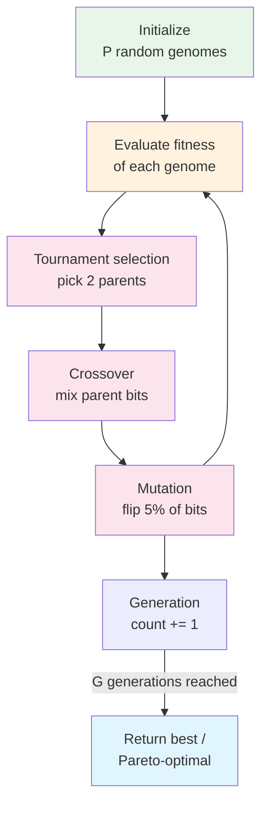

</details>

<details>
<summary>Mermaid diagram — genome and operator mechanics</summary>

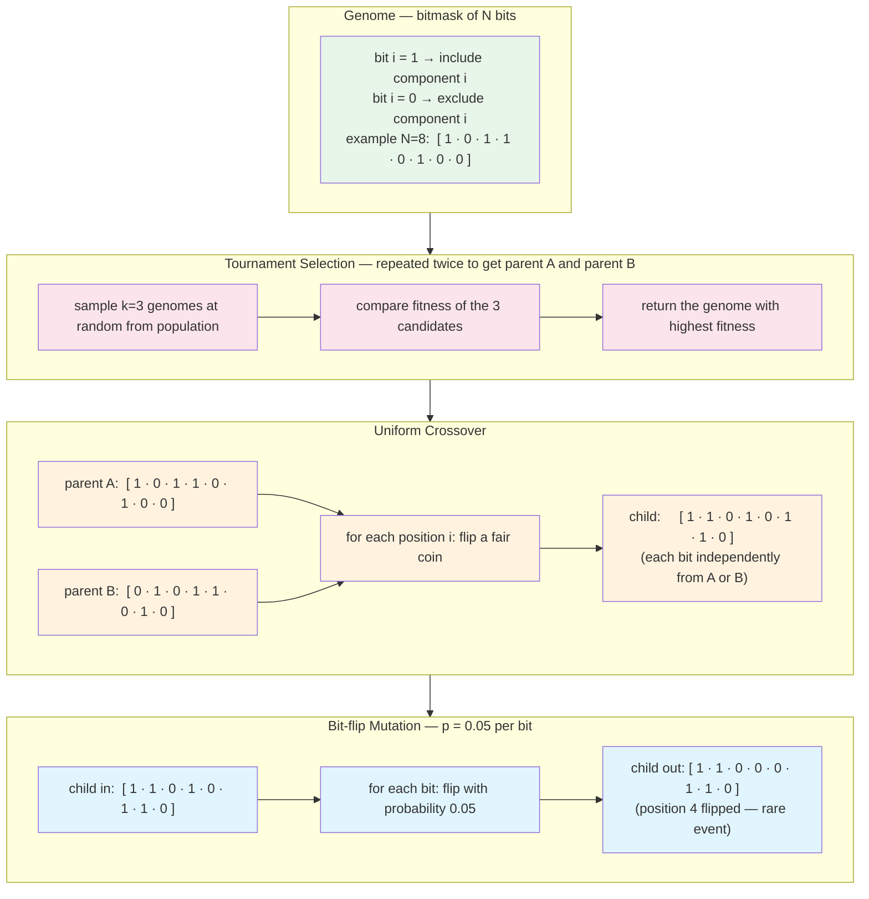

</details>

---

## Slide 13 — Path A, Stage 4: Genetic Algorithm — Full Algorithm

Precisely what runs for one (cluster k, budget tier) pair. This runs 60 times total (20 clusters × 3 budget tiers).

```
INPUTS:
  N        = total number of components across all types
  v        = cluster centroid embedding vector for cluster k
  budget   = token limit for this budget tier (2000 / 4000 / 8000)
  components = list of N ComponentInfo:
               (name, mean_score, query_centroid, token_count, component_type)

GENOME:
  bitmask b ∈ {0,1}^N
  bit[i] = 1 → include component i in this config
  bit[i] = 0 → exclude

FITNESS FUNCTION:
  fitness(b) = Σᵢ [ mean_score_i × cosine(v, centroid_i) × bit_i ]
               − 0.1 × (Σᵢ tokens_i × bit_i) / budget
  Over-budget genomes: heavy negative penalty applied

INITIALIZE:
  Generate 100 random bitmasks (each bit independently = 1 with probability 0.5)

FOR generation = 1 to 200:

  SELECTION (tournament, k=3):
    To select each parent:
      randomly sample 3 genomes from the current population
      return the genome with the highest fitness
    Do this twice → parent_A, parent_B

  CROSSOVER (uniform):
    For each bit position i from 1 to N:
      child[i] = parent_A[i] if random() < 0.5 else parent_B[i]

  MUTATION (bit-flip):
    For each bit position i from 1 to N:
      if random() < 0.05:
        child[i] = 1 − child[i]   ← flip the bit

  Evaluate fitness(child), add to next generation.
  After all children created, next_generation replaces current population.

PARETO FRONT (after generation 200):
  A genome A dominates B if:
    fitness(A) ≥ fitness(B)  AND  tokens(A) ≤ tokens(B)
    with at least one strict inequality
  Pareto front = all genomes not dominated by any other genome

BUDGET SELECTION (from Pareto front):
  candidates = [g for g in pareto_front if tokens(g) ≤ budget]
  if candidates:     pick argmax fitness among candidates
  else:              pick argmin tokens in pareto_front  (smallest config that tries to fit)

OPTIONAL — LLM PARETO VALIDATION:
  For each genome in pareto_front:
    For each of up to 3 representative cluster queries:
      assemble selected component names → prompt LLM → get score 1–10
    avg_llm = mean of LLM scores
    llm_normalized = (avg_llm − 1) / 9.0        ← maps [1,10] to [0,1]
    combined = fitness(genome) × 0.5 + llm_normalized × 0.5
  Re-rank pareto_front by combined score
  Redo budget selection on re-ranked list

COMPONENT ORDERING (after budget selection):
  For each included component i:
    relevance_i = mean_score_i × cosine(v, centroid_i)
  Sort included components by relevance_i descending → store in this order

OUTPUT: {skills: [...], memory: [...], tools: [...], fitness: float, context_tokens: int}
```
<br>

<details>
<summary>Mermaid diagram</summary>

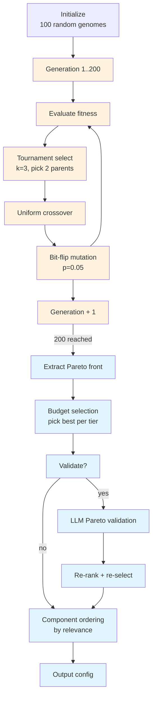

</details>

---

## Slide 14 — Path A, Stage 4a: Evolutionary Search Setup

For each (cluster, budget) pair — default 20 × 3 = 60 optimization targets — run a separate genetic algorithm.

**Genome:** bitmask of length N (number of components)
`bit[i] = 1` means component `c_i` is included, `0` means excluded

**Population:** 100 random bitmask genomes
**Generations:** 200
**Mutation:** bit-flip at probability 0.05 per bit per generation
**Selection:** tournament selection with tournament size k = 3
**Crossover:** uniform crossover (each bit independently inherited from either parent)

Token constraint: a genome that would exceed the budget for its tier receives a fitness penalty.
<br>

<details>
<summary>Mermaid diagram — evolutionary search per target</summary>

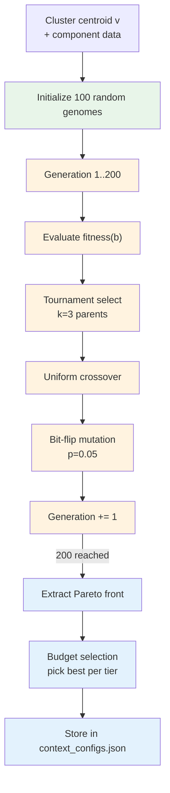

</details>

---

## Slide 15 — Path A, Stage 4b: Fitness Function

For a genome with bits **b** = (b₁, ..., b_N) and cluster centroid vector **v**:

```
fitness(b) = Σᵢ [ mean_score_i × cosine(v, centroid_i) × bᵢ ]
             − λ × (Σᵢ tokens_i × bᵢ) / budget
```

Where:
- `mean_score_i` — component i's synthetic (or enriched) quality score from Path A Stage 1 and Stage 2
- `cosine(v, centroid_i)` — cosine similarity between the cluster centroid and component i's query centroid; measures how relevant this component is to this cluster's queries
- `bᵢ` — 1 if included, 0 if excluded
- `tokens_i` — token count of component i's body
- `budget` — token budget for this tier (small/medium/large)
- `λ` — penalty weight (default: 0.1); controls quality vs. token efficiency tradeoff

First term: reward components that are high quality AND relevant to the current query cluster.
Second term: penalize configs that use a large fraction of the budget.

<details>
<summary>Formula explanation</summary>

The GA needs to score thousands of candidate component combinations. The fitness function answers one question: "is this particular set of components a good set to give the agent for this type of query?" It answers with a single number — higher means better.

The formula has exactly two concerns, and it subtracts one from the other.

**Concern 1 — does this combination actually help?**

For each component you decided to include (bit = 1), add up its contribution. The contribution is two numbers multiplied together:

- `mean_score_i` — how good is this component in general? Computed in Stage 1: the LLM generated queries, the agent answered them with this component in context, the answers were scored. If the component consistently helped produce good answers, its score is high. Think of it as: *"how useful is this component when it is relevant?"*

- `cosine(v, centroid_i)` — how relevant is this component to *this specific cluster of queries?* The cluster centroid `v` is the average direction of queries in this cluster in embedding space. The component centroid is the average direction of queries that component was designed for. If they point in the same direction (high cosine), this component is built for exactly this kind of query. If they point in opposite directions (near-zero cosine), this component serves a totally different topic.

Multiplied together: a component only gets a high reward if it is *both* intrinsically good *and* pointed at the right kind of queries. A brilliant component aimed at the wrong topic gets low reward. A mediocre component that is perfectly on-topic still gets modest reward. Both conditions must hold.

**Concern 2 — does this combination waste tokens?**

Add up the token count of every included component, divide by the budget to get the fraction used, multiply by λ (default 0.1). Subtract this from Concern 1.

The effect: between two combinations with the same quality score, the one that achieves it with fewer tokens wins. λ = 0.1 means token cost is lightly penalized — quality and relevance dominate.

**How the formula was designed:**

Nobody derived it from a theorem. It was constructed by asking: "what are the two things we care about, and how do we combine them into one number?" Quality × relevance for each included component, summed up, minus a small token penalty. Multiplication ensures both conditions must be true simultaneously. The sum rewards combinations, not individual components. The subtraction makes efficiency matter without dominating.

**Parameter λ:** Defaults to 0.1. If `--use-cluster-lambda` is enabled and tuned values exist (from the `tune` command), per-cluster λ values replace the default. If no tuned values exist, the hardcoded default is used.

</details>

<details>
<summary>Mermaid diagram — fitness computation pipeline</summary>

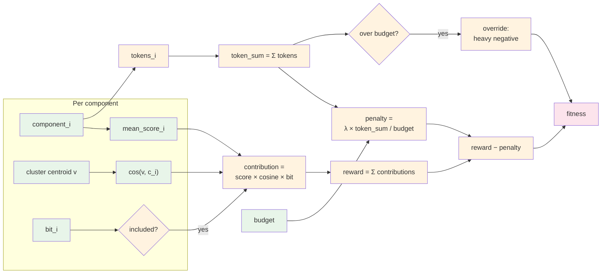

</details>

<details>
<summary>Gap to real ML</summary>

**The fitness function is not learned.** It is hand-crafted and fixed. In a real ML system, the weights would come from data rather than engineering intuition.

**λ defaults to a hardcoded 0.1.** The right value likely differs per cluster, per deployment, and over time. The `tune` command with `--use-cluster-lambda` can learn per-cluster λ values from historical outcomes. If tuned values exist and `--use-cluster-lambda` is enabled, they override the default. If not, the hardcoded default is used. So the gap is partially addressed: tuning is available, but it is not automatic.

**The formula structure itself is not learned.** The multiplication of mean_score × cosine, the linear sum, and the subtraction of token penalty are fixed design choices. The assumptions (quality and relevance multiply, components combine linearly, token cost trades off linearly) were never tested against real data.

**The formula cannot detect combination effects.** Two components that are great together but modest individually will each get modest individual rewards. The fitness function is linear in the bits — it has no interaction term. `--eval-combination-size` at Stage 1 partially addresses this by scoring components jointly, but the GA fitness itself still sums individual contributions.

The closest real-ML equivalent would be a learned ranking model trained on logged (component set, query cluster, outcome quality) triples, fitting the fitness function to actual outcomes. That remains future work.

</details>

---

## Slide 16 — Path A, Stage 4c: Pareto Front

After 200 generations, extract the **Pareto front**: the set of non-dominated genomes.

Definition: genome A dominates genome B if:
- `fitness(A) ≥ fitness(B)` AND
- `tokens(A) ≤ tokens(B)` AND
- at least one inequality is strict

The Pareto front contains configs where no alternative is simultaneously better in quality and more token-efficient. These are the candidates for final selection per budget tier.

For each budget tier: pick the highest-fitness Pareto genome whose total tokens ≤ budget. If none fit, take the smallest genome on the front.
<br>

<details>
<summary>Mermaid diagram — Pareto front extraction</summary>

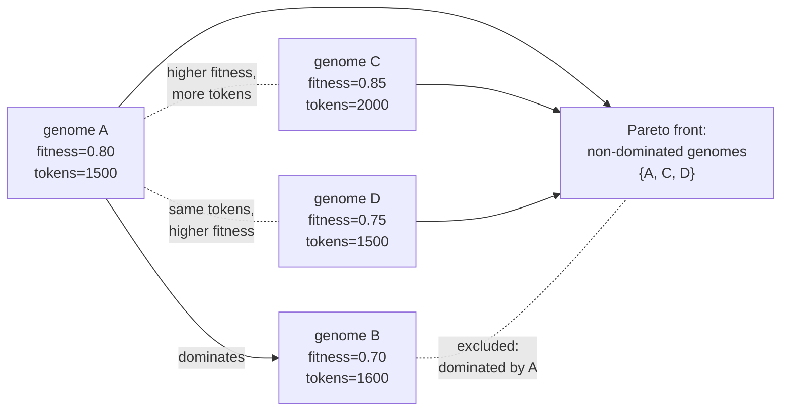

</details>

---

## Slide 17 — Path A, Stage 4d: Optional Pareto Validation

Problem with the proxy fitness: it measures component-level relevance. It cannot detect combination-level effects:
- Two individually high-scoring components may be redundant together (both cover the same aspect)
- Two individually modest components may be complementary (each covers a gap the other has)

**Optional fix — `--validate-pareto`:**

For each genome on the Pareto front, make real LLM calls:
1. Take up to N representative queries from the cluster (default N=3)
2. Assemble the selected component names into a prompt
3. Ask the LLM: "Rate how well this combination matches the query on a scale of 1–10"
4. Average the scores across queries, normalize to [0, 1]: `llm_normalized = (avg - 1) / 9`

Combined score:
```
combined = proxy_fitness × 0.5 + llm_normalized × 0.5
```

Re-rank the Pareto front by combined score. Select best-per-budget from the re-ranked list.

Uses `urllib.request` — no new runtime dependency. Requires `--eval-api-key`. Uses a fast model by default (`gpt-4o-mini`).
<br>

<details>
<summary>Mermaid diagram — LLM Pareto validation</summary>

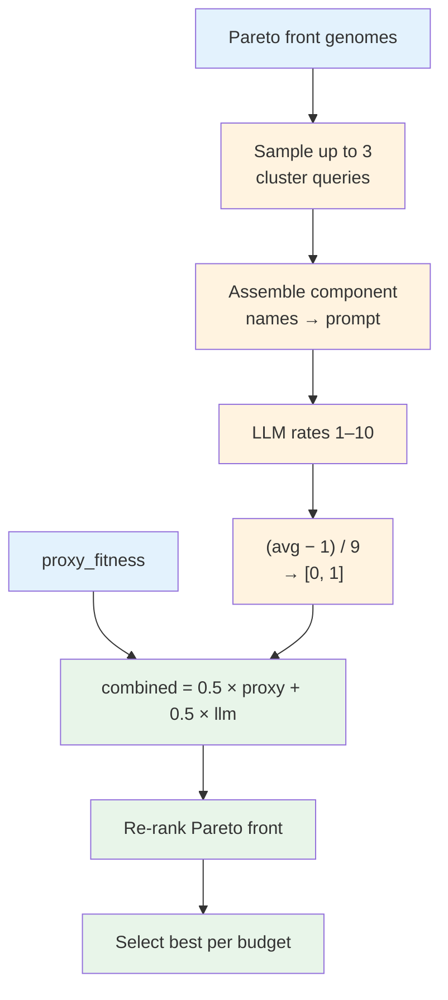

</details>

---

## Slide 18 — Path A, Stage 4e: Component Relevance Ordering

Regardless of whether Pareto validation is active, before writing to `context_configs.json`, components within each selected config are sorted by individual relevance contribution:

```
relevance_i = mean_score_i × cosine(cluster_centroid, query_centroid_i)
```

Components stored most-relevant-first.

Why: at runtime the caller may want to apply a bookend ordering strategy without re-computing per-component scores. Having the components pre-sorted means bookend rearrangement is a simple list operation at query time — no score lookup required.
<br>

<details>
<summary>Mermaid diagram — relevance ordering</summary>

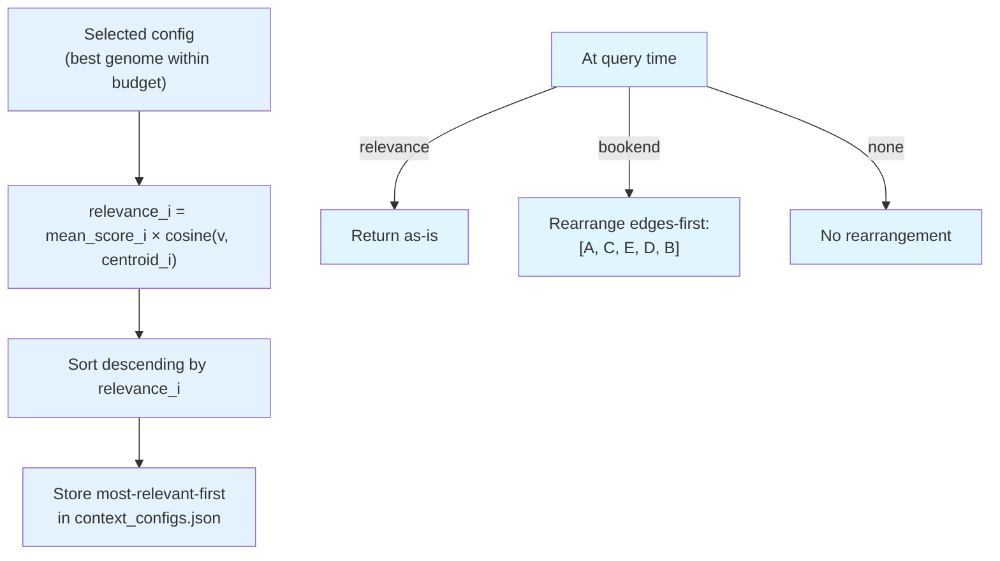

</details>

---

## Slide 19 — Path A, Stage 5: Output Artifact

Written to `context_configs.json`:

```json
{
  "version": 1,
  "built_at": "2025-01-14T09:30:00Z",
  "n_clusters": 20,
  "n_components": 47,
  "embedder": "tfidf",
  "budgets": {"small": 2000, "medium": 4000, "large": 8000},
  "clusters": [
    {
      "cluster_id": 0,
      "n_queries": 234,
      "example_queries": ["..."],
      "optimal_configs": {
        "budget_small": {
          "skills": ["skill-a", "skill-b"],
          "memory": ["proj::Architecture"],
          "tools": ["bash_exec"],
          "fitness": 0.76,
          "context_tokens": 1890
        },
        "budget_medium": { "..." },
        "budget_large":  { "..." }
      }
    }
  ]
}
```

Component lists within each config: most-relevant-first.
`embedder` field: records which backend was used so the runtime can verify consistency.
At query time: pure JSON lookup. No LLM. No embedding model. No network.

---

## Slide 20 — Path A, Query Time: ClusterSelector

The primary query time inference path. Uses Path A Stage 5 artifacts (`context_configs.json` / Stage 3 `.pkl`) only. No model weights at inference.

`ClusterSelector.select(query, budget, ordering)`:

1. Load `context_configs.json` and `context_configs.pkl` (once, cached in memory)
2. Vectorize the raw query text using the saved backend (TF-IDF or sentence-transformer)
3. K-means predict → nearest cluster ID k
4. Lookup `clusters[k].optimal_configs[budget_<budget>]`
5. Apply ordering (see next slide)
6. Return config dict: skills, memory, tools, fitness, context_tokens

Total latency: under 10 milliseconds (once artifacts are loaded).

`ClusterSelector.select_all_budgets(query, ordering)`: returns configs for all three budget tiers in one call. Useful for inspection or when the caller wants to choose the budget dynamically.
<br>

<details>
<summary>Mermaid diagram — query time cluster lookup</summary>

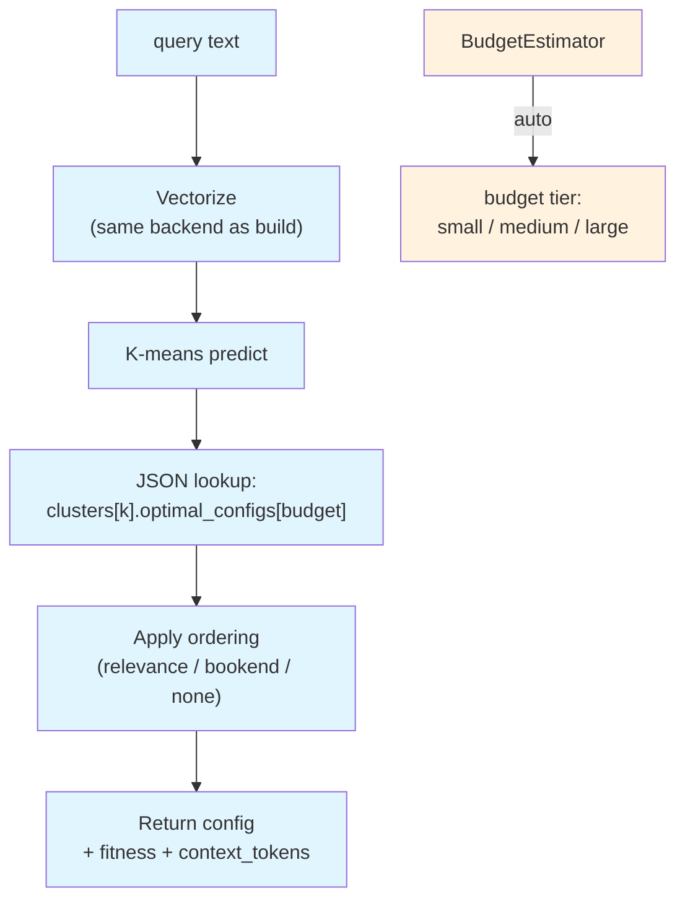

</details>

---

## Slide 21 — Path A, Query Time: Component Ordering Strategies

The stored component lists are already sorted most-relevant-first from the build step.

Three ordering modes, passed as `ordering` parameter:

**`"relevance"` (default)**
Return the stored order as-is. Most-relevant component is first. Appropriate for sequential prompt assembly where earlier entries receive more attention naturally.

**`"bookend"`**
Rearrange the relevance-sorted list into a bookend pattern. Most-relevant at position 0 (first), second-most-relevant at position -1 (last), third at position 1 (second), fourth at position -2 (second-to-last), and so on.

Example: `[A, B, C, D, E]` (sorted most → least relevant) → `[A, C, E, D, B]`

Motivation: LLMs attend more strongly to text near the beginning and end of the context window (Liu et al., 2024, "lost-in-the-middle" effect). Bookend ordering places the most critical components where attention is strongest.

**`"none"`**
Return the raw stored order without rearrangement.

`bookend_order()` is implemented in `shared/context_orderer.py` and used by `ClusterSelector._apply_ordering()`.
<br>

<details>
<summary>Mermaid diagram — ordering modes</summary>

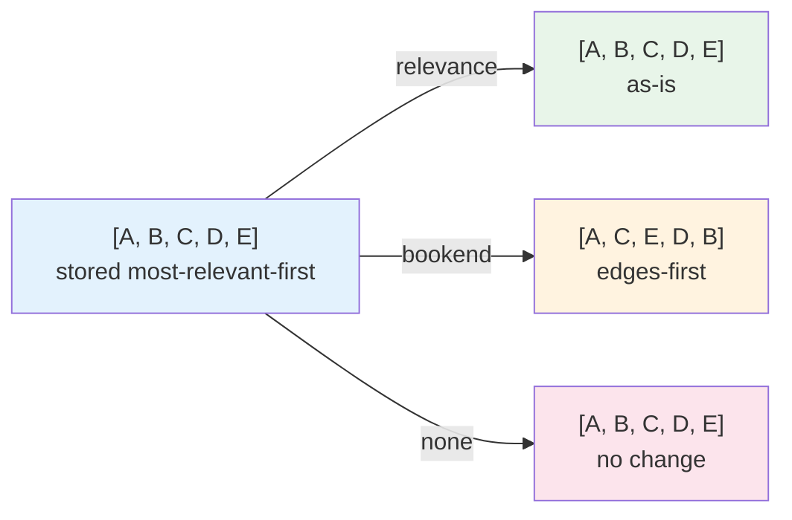

</details>

---

## Slide 22 — Path A, Query Time: Automatic Budget Estimation

When the caller does not know or does not want to specify a budget level, use:

`ClusterSelector.select_auto(query, ordering)` — or CLI flag `--budget auto`

Internally calls `BudgetEstimator.estimate(query)`:

```
Heuristic rules, applied in order:

1. If word count < 8          → "small"
   (short queries need less context)

2. If multi-step language detected → "large"
   Patterns: "step by step", "first ... then", "and then",
   "after that", "set up ... and ... configure",
   "end-to-end", "full workflow", "create ... pipeline", etc.
   (complex procedural queries need full context)

3. If word count > 35         → "large"
   (long queries imply complex tasks)

4. Otherwise                  → "medium"
```

The estimated budget is returned in the config under the `"budget"` key so the caller can see what was inferred.

`BudgetEstimator` lives in `context_selectors/budget_estimator.py`. It has no dependency on the clusterer or the artifacts — it is a pure text heuristic.
<br>

<details>
<summary>Mermaid diagram — budget estimation rules</summary>

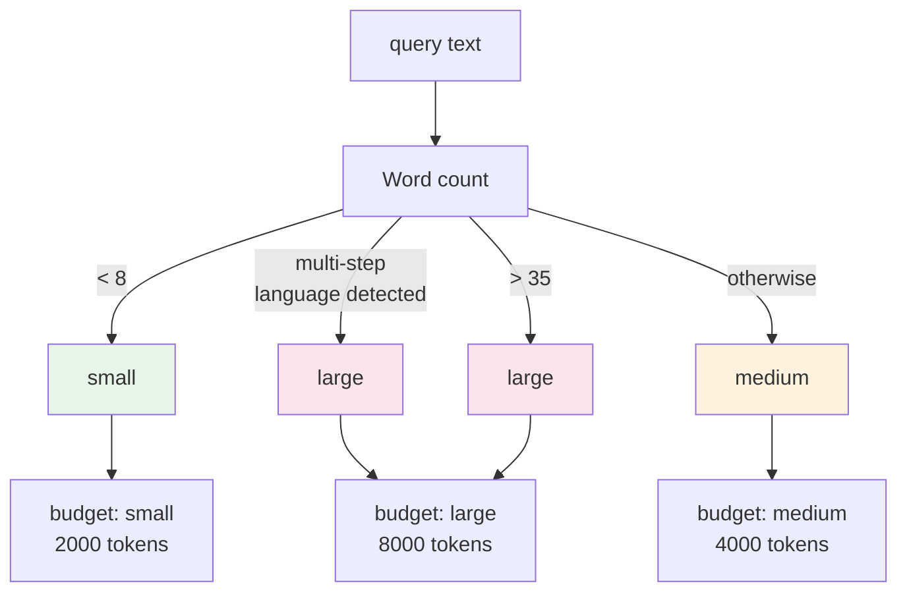

</details>

---

## Slide 23 — Path B — Classifier Path in Detail

(data-rich: learns from logged turns, activates after 500+ turns)

```
CLASSIFIER TRAINING  [requires >= 500 logged turns]
  Input:  turns_YYYY-WNN.jsonl from last 8 weeks
  Reads raw JSONL logs directly.

  The classifier is the heart of Path B. It learns which components to include
  for each query type from real usage patterns — something the evolutionary
  selector cannot do because it optimizes per cluster, not per query.

  N classifiers, one per component cᵢ:
    features: query_embedding from each turn where cᵢ was in context
    label:    1 if outcome_quality > 0.5 else 0
    model:    LogisticRegression, L2 regularization, C=1.0
  Off-policy explored turns included → corrects selection bias
  Output: classifier.pkl  (W matrix N×d, bias N-vector, component_names list)

───────────────────────────────────────────────────────────
EVALUATION + REGISTRY
  Input: trained classifier + held-out validation turns (chronological 20%)

  Per-component metrics: precision, recall, F1, AUC
  Aggregate: macro-F1, mean AUC
  ↓
  Promotion gate: macro-F1 improves over current model by ≥ 0.01 ?
    yes → register as classifier_YYYY-MM-DD_HHMMSS.pkl
         → write classifier_registry.json (turn count, F1, AUC)
         → update classifier_current.pkl symlink
    no  → archive without promoting; previous model stays active

───────────────────────────────────────────────────────────
QUERY TIME — ClassifierSelector (< 1 ms)
    query_embedding ∈ ℝᵈ
    → pᵢ = σ(Wᵢ · e + bᵢ) for each component i
    → include if pᵢ > 0.5
    → confidence = mean(max(pᵢ, 1−pᵢ))
    → return {skills, memory, tools, confidence, source="classifier"}

```
<br>

<details>
<summary>Mermaid diagram</summary>

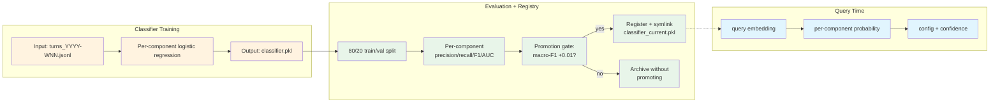

</details>

---

## Slide 24 — Path B: How Logistic Regression Works (General Explanation)

Logistic regression is one of the simplest and most robust classification models in machine learning. Despite the name "regression", it is a classifier: it predicts the probability that an input belongs to a category.

**Core idea:** compute a weighted sum of input features, then squash the result into the range [0, 1] using the sigmoid function, which turns any number into a probability.

```
Given:
  input  x ∈ ℝᵈ      (a feature vector — e.g., a query embedding)
  weights W ∈ ℝᵈ     (learned parameters, one per input feature)
  bias   b ∈ ℝ        (learned offset)

Step 1 — Linear combination:
  z = W · x + b       (dot product of weights and features, plus bias)

Step 2 — Sigmoid squash:
  p = σ(z) = 1 / (1 + e^{-z})
  → z = +∞ → p → 1.0   (very confident: positive class)
  → z =  0 → p = 0.5   (uncertain)
  → z = −∞ → p → 0.0   (very confident: negative class)

Decision: include if p > 0.5 (threshold can be adjusted)
```

**How training finds W and b:**
Minimize cross-entropy loss over training examples (yⱼ = true label, p̂ⱼ = predicted probability):
```
loss = −Σⱼ [ yⱼ × log(p̂ⱼ) + (1 − yⱼ) × log(1 − p̂ⱼ) ]
```
This loss is low when the model assigns high probability to positive examples and low probability to negative ones. Optimized with gradient descent (handled by scikit-learn internally).

**L2 regularization:** adds `(1/C) × Σᵢ Wᵢ²` to the loss. Forces weights to stay small. Prevents overfitting when the dataset is small. C controls the strength: higher C = less regularization = more freedom to fit training data.

**Why logistic regression is the right choice here:**
- Works with high-dimensional sparse inputs (TF-IDF embeddings have up to 2000 dimensions)
- No GPU required, trains in milliseconds even with thousands of examples
- Interpretable: the weight vector W directly shows which embedding dimensions predict inclusion
- Produces calibrated probabilities, not just binary yes/no — confidence estimation comes for free
- L2 regularization handles small datasets gracefully
- Scales to N components by training N independent models in parallel
<br>

<details>
<summary>Mermaid diagram</summary>

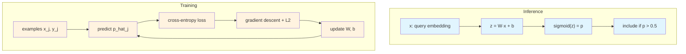

</details>

---

## Slide 25 — Path B: Classifier Algorithm in Detail

Not one classifier — **N classifiers, one per component**. Each independently learns the question: "given this query, should I include this specific component?"

```
STRUCTURE:
  N components → N independent logistic regression models
  Each model i has:
    weights  Wᵢ ∈ ℝᵈ   where d = embedding dimension
                        (d = 2000 for TF-IDF, d = 384 for all-MiniLM-L6-v2)
    bias     bᵢ ∈ ℝ
  P(include component i | query embedding e) = σ(Wᵢ · e + bᵢ)

GUARD CONDITION:
  If total logged turns < 10 → do not train, do not write classifier.pkl
  Reason: a classifier trained on 2-3 turns will overfit noise and override
          a well-optimized cluster config with garbage predictions.

TRAINING DATA SOURCE:
  Weekly JSONL log files: turns_YYYY-WNN.jsonl
  Recency window: last 8 weeks only
  Reason: prevents old interaction patterns from dominating after the
          skill library or agent behavior has changed.

BUILDING TRAINING DATA (per component cᵢ):
  Scan all logged turns in the recency window.
  For each turn where cᵢ appears in context_config:
    feature: query_embedding vector (as logged — the vector used at selection time)
    label:   1  if outcome_quality > 0.5
             0  if outcome_quality ≤ 0.5

  Outcome quality formula:
    quality = 0.5
            + 0.20 if task_completed
            − 0.30 if follow_up_correction
            + max(0, 0.10 − 0.02 × conversation_length)
    clamped to [0.0, 1.0]
    (explicit rating overrides: "positive" → 1.0, "negative" → 0.0)

OFF-POLICY EXPLORED TURNS:
  Turns flagged with exploration.explored = true contain components
  the selector did NOT originally choose (they were randomly added).
  These turns ARE included in training.
  Without them, the classifier can only learn from components it already favored.
  With them, it gets signal on components it would never have seen selected.

TRAINING PROCEDURE (per component cᵢ):
  features = all query_embedding vectors from turns where cᵢ was in context
  labels   = [1 if quality > 0.5 else 0 for each turn]

  fit LogisticRegression(
    penalty = 'l2',
    C       = 1.0,     ← inverse regularization strength (scikit-learn standard)
                         lower C = stronger regularization = simpler boundaries
                         higher C = weaker regularization = closer fit to data
                         tuned values (from `tune` command) override this default
    solver  = 'lbfgs'  ← scikit-learn default for L2
  ) on (features, labels)

  Store: Wᵢ (weight vector), bᵢ (bias scalar)

INFERENCE (at query time, given embedding e):
  For each component i from 1 to N:
    pᵢ = σ(Wᵢ · e + bᵢ)        ← one dot product per component, sub-millisecond total
    thresholdᵢ = tuned threshold for component i if tuned values exist, else 0.5
    include cᵢ if pᵢ > thresholdᵢ

  Tuned parameters override defaults:
    - C and threshold per component: set by `tune` command, stored in oracle dir
    - If tuned values exist, `train-classifier` picks them up automatically
    - If no tuned values exist, defaults apply (C=1.0, threshold=0.5)

  Confidence score:
    confidence = mean over all i of max(pᵢ, 1 − pᵢ)
    → close to 1.0:  classifier is certain about most components → trust it
    → close to 0.5:  classifier is uncertain → consider falling back to ClusterSelector

SERIALIZATION:
  classifier.pkl stores:
    W     = N × d weight matrix
    b     = N-vector of biases
    names = list of N component names (maps row index → component)
  Loaded once at startup, held in memory for sub-millisecond inference.
```

<details>
<summary>Gap to real ML</summary>

N independent logistic regression models, one per component, each predicting inclusion independently of all other components. This is structurally incapable of modeling the combinatorial nature of context selection.

**Each classifier sees only its own component.** The model for component A learns "does this query embedding correlate with good outcomes when A is in context?" It does not know whether B and C are also in context, whether A is redundant with B, or whether A is necessary only when paired with a specific tool. The decisions are made independently, but inclusion should be a joint decision.

**Joint necessity cannot be represented.** If skill A and tool B are jointly necessary for a class of tasks — neither is useful alone, but together they are essential — every turn that has A alone produces bad outcomes, every turn that has B alone produces bad outcomes, and every turn that has A+B produces good outcomes. The classifier for A will learn "A has low correlation with good outcomes" and assign it low probability. The classifier for B will do the same. The pair will be excluded even though it should always be included together.

**The fix would require modeling all N components jointly.** A single model with N binary outputs, using a shared representation, could learn "given this query embedding and given that B is included, A should also be included." Options: a multi-label classifier (one model, N outputs), a model that takes currently-selected components as additional features, or a sequential selection model. All are more complex and require more data. Logistic regression was chosen because it works with small datasets, trains in milliseconds, and requires no GPU — the right choice for early deployment, but limiting at scale.

</details>
<br>

<details>
<summary>Mermaid diagram</summary>

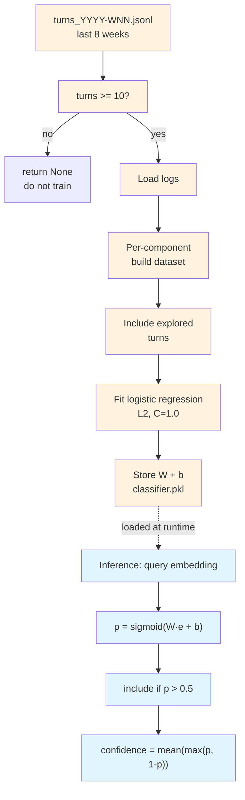

</details>

---

## Slide 26 — Path B: Off-Policy Exploration

Before the classifier trains, the logging must produce unbiased training data. By default, it does not.

If the selector always chooses components A, B, C for cluster 5 — the logs only contain turns with A, B, C in context. The classifier can never learn whether D, E, F would have been good for cluster 5 queries. This is **off-policy bias**.

Fix: `TurnLogger.log_turn` accepts `exploration_rate` and `all_component_names`.

When `exploration_rate > 0` (e.g., 0.05 or 0.10):
- For each unselected component in the pool, add it to the context with probability = exploration_rate
- The agent runs with this augmented context (quality may be slightly worse on explored turns)
- The record is flagged with `"exploration": {"explored": true, ...}`

The classifier trainer identifies explored turns and includes them in training, giving coverage of component–query pairs that the pure selector would never have produced.

Practical calibration: 0.05–0.10. Low enough not to visibly degrade most turns. High enough to accumulate counterfactual evidence within a few hundred turns.

---

## Slide 27 — Path B: Turn Logging Format

Each agent turn is recorded as one JSONL line:

```json
{
  "turn_id": "<uuid>",
  "timestamp": "2025-01-14T09:12:00Z",
  "query_embedding": [0.12, -0.34, ...],
  "context_config": {
    "skills": ["devops-toolkit"],
    "memory_sections": ["project.md::Architecture"],
    "tools": ["bash_exec"]
  },
  "outcome": {
    "explicit_rating": null,
    "implicit_signals": {
      "task_completed": true,
      "follow_up_correction": false,
      "conversation_length": 3
    },
    "component_usage": {
      "skills_used": ["devops-toolkit"],
      "tools_called": ["bash_exec"]
    }
  },
  "exploration": { "explored": true, "exploration_rate": 0.05, "explored_additions": {...} }
}
```

Note: raw query text is NOT stored. Only the embedding vector is logged. This is a deliberate privacy decision.

---

## Slide 28 — Path B: Outcome Quality Scalar

Outcome quality for each turn is computed as a scalar in [0, 1]:

```
quality = 0.5
        + 0.20  if task_completed
        − 0.30  if follow_up_correction
        + max(0, 0.10 − 0.02 × conversation_length)

clamped to [0.0, 1.0]
```

Interpretation:
- Base = 0.5 (neutral)
- Task completed adds 0.20 (positive signal)
- Follow-up correction (user had to correct the agent) subtracts 0.30 (strong negative)
- Shorter conversations are better (max +0.10 at length 0, 0 at length 5+)

If an explicit rating is logged: "positive" → 1.0, "negative" → 0.0. Overrides the formula.

This scalar is the training label in Path B classifier training.

---

## Slide 29 — Path B: Component Inclusion Classifier

Model type: **logistic regression**, one binary classifier per component.

Given query embedding **e** ∈ ℝᵈ, probability that component cᵢ should be included:

```
P(include_i | e) = σ(Wᵢ · e + bᵢ)
```

Where:
- **W** ∈ ℝ^{N × d} — learned weight matrix (one row per component)
- **b** ∈ ℝ^N — bias vector
- σ — sigmoid function

Training (per component):
- Positive examples: turns where cᵢ was in context AND outcome quality > 0.5
- Negative examples: turns where cᵢ was in context AND outcome quality ≤ 0.5
- Regularization: L2, strength controlled by parameter C (default 1.0; higher C = less regularization)
- Solver: scikit-learn `LogisticRegression`

At inference: include components with probability > threshold (default 0.5).

Confidence score returned: `mean(max(p, 1−p))` across all components. Low confidence means the model is uncertain — the caller decides whether to trust the prediction or use another method entirely.

Serialized as `classifier.pkl` (weight matrix + bias + component name list).

---

## Slide 30 — Path B: Training Requirements

**Minimum data guard:** training requires at least `min_turns` logged turns (default: 10). If fewer than 10 turns exist, the trainer returns `None` — the classifier is not trained.

Why: a classifier trained on 3 turns will overfit noise. It should not override a well-optimized cluster config.

**Recency window:** the trainer reads weekly JSONL log files covering the most recent `max_weeks` weeks (default: 8). This prevents very old interaction patterns from dominating when the agent's behavior or skill library has since changed.

**Explored turns:** turns flagged with `exploration.explored = true` are included in training. This is the mechanism by which off-policy exploration corrects the selection bias — the trainer sees component–query pairs that the selector would never have produced on its own.

---

## Slide 31 — Path B: Model Evaluation and Registry

Every classifier training run is measured before it is deployed.

**Train/validation split:** logs are split chronologically (80% train, 20% validation). The validation set always contains the most recent turns, so the model is evaluated on the behavior it will actually see in production.

**Per-component metrics:** precision, recall, F1, and AUC are computed independently for each of the N component classifiers. A component with few logged turns will have noisier metrics than a component with hundreds.

**Promotion gate:** a new model is activated only if its validation macro-F1 improves over the current active model by at least 0.01. If the gate fails, the previous model remains active and the new model is archived. Use `--force-promote` to bypass the gate when manual override is needed.

**Registry:** every trained model is stored as `classifier_YYYY-MM-DD_HHMMSS.pkl`. The registry at `classifier_registry.json` tracks training date, turn count, validation macro-F1, mean AUC, and active status. `classifier_current.pkl` is a symlink to the active model. `list-versions` prints the registry in a human-readable table.

Rollback: because previous versions are retained, an operator can restore an older model by updating the symlink if a newly promoted model degrades in production.

---

## Slide 32 — Hyperparameter Tuning

Fixed defaults are starting points. The `tune` subcommand searches for better values using the held-out validation set.

**Classifier hyperparameters (grid search):**
- `C`: [0.01, 0.1, 0.5, 1.0, 5.0, 10.0] — regularization strength
- `threshold`: [0.3, 0.4, 0.5, 0.6, 0.7] — inclusion cutoff
- For each (C, threshold): train on 80%, evaluate macro-F1 on 20%
- Best pair is stored in `classifier_registry.json`
- Per-component threshold sweep: after global tuning, each component is independently swept over [0.3, 0.5, 0.7] and its best value is written to `classifier_thresholds.json`

**Cluster count tuning (`--auto-k`):**
- Fits K-means for K in [5, 10, 15, 20, 30, 50]
- Computes inertia and silhouette score
- Selects K at the elbow of the inertia curve
- Result is used automatically in the next `evolve` run

**Per-cluster λ tuning (`--use-cluster-lambda`):**
- After at least 100 logged turns, computes Spearman correlation between config fitness (using different λ values) and mean outcome quality of turns assigned to each cluster
- Selects the λ that maximizes correlation per cluster
- Writes `per_cluster_lambda.json`; `fitness_computer.py` loads it when available

**Consumption rule:** Every downstream command checks for tuned values first. If they exist, they are used automatically. If not, hardcoded defaults apply. This means tuning is optional — the system works without it, but works better with it.

| Parameter | Default | Tuned value source | Consumed by |
|---|---|---|---|
| C | 1.0 | `tune` → classifier registry | `train-classifier` |
| threshold | 0.5 | `tune` → per-component sweep | `train-classifier` |
| K | 20 | `tune --auto-k` → optimal K | `evolve` |
| λ | 0.1 | `tune --use-cluster-lambda` → per-cluster values | `evolve` |

---

## Slide 33 — Path B, Query Time: ClassifierSelector

Path B query-time inference. Uses `classifier.pkl`. Accepts a pre-computed embedding, not raw text.

`ClassifierSelector.select(embedding)`:

1. Load `classifier.pkl` (once, cached)
2. Compute `P(include_i | embedding)` for each component i using logistic regression weights
3. Include components where probability > threshold (default 0.5)
4. Compute confidence: `mean(max(p, 1−p))` across all N components
5. Return config dict: skills, memory, tools, confidence, source="classifier"

`ClassifierSelector` is invoked directly by the caller when a trained classifier exists.

Typical integration: trigger ClassifierSelector when `classifier.pkl` exists and the returned confidence is above the caller's threshold.

---

## Slide 34 — Shared Infrastructure: Feedback Loop

Both paths depend on the same interaction log stream. The feedback loop is independent of either path — it just writes the data that both paths read later.

**What gets logged per turn:**

- `query_embedding` — the vector that was used for selection (not raw text, for privacy)
- `context_config` — which components were in context
- `outcome` — implicit signals: task_completed, follow_up_correction, conversation_length, plus explicit operator rating if available
- `exploration` — flag if extra components were randomly added for off-policy learning

**How outcomes are scored:**

```
quality = 0.5
        + 0.20 if task_completed
        − 0.30 if follow_up_correction
        + max(0, 0.10 − 0.02 × conversation_length)
clamped to [0.0, 1.0]
```

Explicit rating overrides: "positive" → 1.0, "negative" → 0.0.

**Who reads the logs:**

- **Path A Stage 2** — reads component presence + outcome to compute `updated_mean_score` via Bayesian blending
- **Path B classifier trainer** — reads query embedding + component presence + outcome to train logistic regression weights

Both paths read from the same `turns_YYYY-WNN.jsonl` files but use different fields and do different math with them. Neither path blocks the other.

<details>
<summary>Gap to real ML</summary>

Path A and Path B are fully independent and do not inform each other. This leaves two cross-informing opportunities on the table.

**The classifier does not use the cluster oracle as a prior.** When Path B starts training with 10–50 turns per component, the logistic regression has very little data. The cluster oracle (Path A) already contains strong signal about which components are relevant to which query clusters. A real ML system would initialize the classifier weights from the cluster oracle's relevance scores — essentially warm-starting Path B with Path A's knowledge. Instead, the classifier starts from random initialization every time and must learn everything from scratch from logged data.

**The GA fitness function does not use what the classifier has learned.** After Path B has been running for hundreds of turns, the classifier's learned weights contain real-data signal about which query embeddings correlate with which component inclusions producing good outcomes. This is exactly the signal the GA's fitness function is approximating with synthetic lexical scores. In a mature system, you would feed the classifier's predictions back into the evolutionary search — using the classifier to estimate fitness for genome candidates rather than (or in addition to) the hand-crafted formula. The two paths would become mutually reinforcing rather than independent.

Keeping paths independent was the right early architectural choice: simpler to build, simpler to debug, fails independently. But the long-term improvement path is to make them cross-inform.

</details>

---

## Slide 35 — System Maturity Levels

The system has defined behavior at every maturity level. Automatic monitoring (`status`, `check-rebuild`) detects drift and staleness and recommends when to retrain or rebuild. The caller chooses between two paths based on the situation:

| System state | Path | Behavior |
|---|---|---|
| Fresh deployment, no logs | Path A — Cluster | Lookup using synthetic scores from Path A Stage 1 |
| Some logs, < 100 turns | Path A — Cluster | Path A Stage 2 enrichment not yet active |
| 100–500 turns | Path A — Cluster | Path A Stage 2 blending active; Path B classifier training in progress |
| 500+ turns, classifier trained | Path B — Classifier | Per-component inclusion prediction from query embedding |
| Classifier not yet trained | Path A — Cluster | Path A cluster lookup works at all times, regardless of Path B state |

Both paths are always valid. The system never fails. The caller decides which to use based on its own policy.

---

## Slide 36 — Shared Infrastructure: Drift Detection and Monitoring

The system monitors itself and recommends when to retrain or rebuild.

**Query distribution monitor (`shared/distribution_monitor.py`):**
- Maintains rolling embeddings of recent queries (1-week and 4-week windows)
- Computes Jensen-Shannon divergence between the two windows on TF-IDF histograms
- Threshold: JS divergence > 0.15 → flags potential drift
- Writes `drift_status.json`: detected, divergence value, window sizes, timestamp

**Oracle staleness checker (`oracle_builder/staleness_checker.py`):**
- Loads `context_configs.json` and re-scans current component sources
- Detects: new components not in the oracle, removed components still referenced, components with changed fingerprints
- Writes `staleness_status.json`: stale flag, lists of added/removed/changed components

**Retraining scheduler (`oracle_builder/rebuild_recommender/`):**
- `should_retrain_classifier()`: returns True if drift detected, or turns since last training > threshold (default 500), or last training older than interval (default 7 days)
- `should_rebuild_oracle()`: returns True if oracle is stale, or drift detected and last rebuild > 14 days

**CLI:**
- `status` — runs drift monitor and staleness checker, prints human-readable summary
- `check-rebuild` — prints "REBUILD RECOMMENDED: [reasons]" or "NO REBUILD NEEDED"; exits with code 2 when rebuild is needed (for scripted workflows)

---

## Slide 37 — Data Flow Summary

```
PATH A — EVOLUTIONARY SELECTOR:

skills/ + memory/ + tools/
        ↓ (Stage 1: LLM evaluation)
scoring_matrix_*.json  [mean_score, example_queries]
        ↓ (Stage 2: optional blend real logs)
scoring_matrix_*.json  [updated_mean_score]
        ↓ (Stage 3: cluster + centroids)
        ↓ (Stage 4: genetic algorithm per cluster × budget)
        ↓ (Stage 5: write configs + fitted clusterer)
context_configs.json   [optimal_configs per cluster × budget, relevance-sorted]
context_configs.pkl    [fitted clusterer for query time prediction]

PATH B — CLASSIFIER PATH:

agent runs → outcome observed → logged to turns_YYYY-WNN.jsonl
                                 ↓ (classifier training on raw logs)
                             classifier.pkl  [W, b, component names]
                                 ↓ (80/20 evaluation + promotion gate)
                             classifier_current.pkl  [active model symlink]
                                  ↑ reads embedding + config + outcome from raw logs

MONITORING:

  query embeddings over time  →  distribution_monitor  →  drift_status.json
  component sources (skills/memory/tools)  →  staleness_checker  →  staleness_status.json
  drift_status + staleness_status  →  retraining_scheduler  →  rebuild recommendation

QUERY TIME (two selectors):

Path A — ClusterSelector:
  query text
    → vectorize (same backend as build)
    → predict cluster
    → lookup config
    → apply ordering
    → return {skills, memory, tools}

Path B — ClassifierSelector:
  query embedding
    → σ(W·e + b) per component
    → include if probability > 0.5
    → return {skills, memory, tools, confidence}

FEEDBACK LOOP:
  Logged turns feed both paths in the next offline cycle.
```
<br>

<details>
<summary>Mermaid diagram</summary>

```mermaid
graph TD
    subgraph "Path A — Evolutionary Selector"
        PA1["skills/ + memory/ + tools/"] -->|Stage 1: LLM eval| PA2["scoring_matrix_*.json"]
        PA2 -->|Stage 2: blend real logs| PA3["scoring_matrix_*.json<br/>[updated_mean_score]"]
        PA3 -->|Stage 3: cluster + centroids| PA4["Stage 4: genetic algorithm"]
        PA4 -->|Stage 5: write| PA5["context_configs.json + .pkl"]
    end

    subgraph "Path B — Classifier Path"
        PB_AGENT["agent runs"] -->|outcome observed| PB_LOG["turns_YYYY-WNN.jsonl"]
        PB_LOG -->|train| PB_CLS["classifier.pkl<br/>[W, b, names]"]
        PB_CLS -->|evaluate + promote| PB_CUR["classifier_current.pkl<br/>[active model]"]
    end

    subgraph "Monitoring"
        MON_EMB["query embeddings<br/>1-week + 4-week windows"] -->|JS divergence| MON_DRIFT["drift_status.json"]
        MON_SRC["component sources"] -->|diff| MON_STALE["staleness_status.json"]
        MON_DRIFT -->|recommend| MON_REC["rebuild / retrain"]
        MON_STALE --> MON_REC
    end

    subgraph "Query Time"
        PA5 -->|ClusterSelector| QA["query text → cluster → config"]
        PB_CUR -->|ClassifierSelector| QB["query embedding → probabilities → config"]
    end

    style QA fill:#e1f5fe
    style QB fill:#e1f5fe
```

</details>

---

## Slide 38 — Key Algorithmic Decisions: Summary

| Decision | What was chosen | Why |
|---|---|---|
| Fitness evaluation at search time | Dot product + arithmetic (no LLM) | Makes GA tractable over 60 cluster×budget targets |
| Cluster count K | 20 (configurable) | Fixed at build time; must be rebuilt if query distribution shifts |
| GA population | 100 genomes | Balance between coverage and compute |
| GA generations | 200 | Enough for convergence at this population size |
| Mutation rate | 0.05 per bit | Standard for binary GA; prevents premature convergence |
| Pareto front | Non-dominated set by (fitness, tokens) | Avoids committing to one quality/efficiency tradeoff before budget selection |
| Pareto validation alpha | 0.5 | Equal weight to proxy fitness and LLM score |
| Bayesian blend threshold | 100 turns | Enough real data to trust; prevents early noise from overriding synthetic prior |
| Classifier type | Logistic regression, one per component | Linear, interpretable, no GPU required, fast at inference |
| Classifier threshold | 0.5 | Symmetric; can be tuned per deployment |
| Exploration rate | 0.05–0.10 | Low enough not to degrade quality; high enough to accumulate counterfactual data |
| Outcome formula baseline | 0.5 | Neutral default; task completion adds 0.20; correction subtracts 0.30 |
| Ordering stored in artifact | Most-relevant-first | Runtime bookend requires no score recomputation |
| Budget estimation | Heuristic (word count + regex) | Zero latency; no model required; good enough for typical query lengths |
| Model evaluation | Chronological 80/20 train/val split; per-component precision/recall/F1/AUC | Measurement required before tuning or promotion |
| Hyperparameter tuning | Grid search over C × threshold; elbow+silhouette for K; Spearman correlation for per-cluster λ | Defaults are starting points; tuned values derived from data |

---

## Slide 39 — CLI Reference

```bash
# Path A — Stage 1+2: score components
python -m jiuwenswarm.thalamus.component_scoring build \
    --type {skills|memory|tools|enrich|all} \
    --skills-dir /path --project-dir /path --tools-dir /path \
    --matrix-dir /oracle --model gpt-4o-mini --api-key $KEY \
    --metrics f1,bigram_f1,bag_of_words,length_ratio,bert_score,llm_judge \
    --eval-combination-size 1

# Path A — Stages 3–5: build oracle (cluster, evolve, write)
python -m jiuwenswarm.thalamus.oracle_builder evolve \
    --oracle-dir /oracle --n-clusters 20 --population 100 --generations 200

# Path A — with semantic clustering
python -m jiuwenswarm.thalamus.oracle_builder evolve \
    --oracle-dir /oracle --embedder sentence --sentence-model all-MiniLM-L6-v2

# Path A — with Pareto validation
python -m jiuwenswarm.thalamus.oracle_builder evolve \
    --oracle-dir /oracle --validate-pareto \
    --eval-model gpt-4o-mini --eval-api-key $KEY --eval-queries-per-cluster 3

# Path B: train classifier
python -m jiuwenswarm.thalamus.oracle_builder train-classifier \
    --oracle-dir /oracle --min-turns 10 \
    --judge-model gpt-4o-mini --judge-api-key $KEY \
    --force-promote

# Query time lookup (Path A — cluster-based)
python -m jiuwenswarm.thalamus.context_selectors lookup \
    --oracle-dir /oracle \
    --query "Set up a CI pipeline" --budget auto --ordering bookend

# Path B — list classifier versions
python -m jiuwenswarm.thalamus.oracle_builder list-versions \
    --oracle-dir /oracle

# Path B — tune hyperparameters (grid-search C, threshold, K, λ)
python -m jiuwenswarm.thalamus.oracle_builder tune \
    --oracle-dir /oracle --log-dir /logs

# Monitoring — check drift and staleness
python -m jiuwenswarm.thalamus.oracle_builder status \
    --oracle-dir /oracle --skills-dir /skills --project-dir /project --tools-dir /tools

# Monitoring — recommend rebuild or retrain
python -m jiuwenswarm.thalamus.oracle_builder check-rebuild \
    --oracle-dir /oracle

# Query time classify (Path B — classifier-based)
python -m jiuwenswarm.thalamus.context_selectors classify \
    --oracle-dir /oracle --embedding ./query.npy --threshold 0.5 --verbose
```

---

## Slide 40 — Key Parameters Reference

| Parameter | Default | What it controls |
|---|---|---|
| `--n-examples` | 20 | LLM pairs generated per component in Path A Stage 1 |
| `--parallel` | 5 | Concurrent LLM requests in Path A Stage 1 |
| `--n-clusters` | 20 | K-means K; fixed at build time |
| `--embedder` | `tfidf` | `tfidf` or `sentence` |
| `--sentence-model` | `all-MiniLM-L6-v2` | Sentence-transformer model name |
| `--population` | 100 | GA genomes per cluster×budget run |
| `--generations` | 200 | GA generation count |
| `--mutation-rate` | 0.05 | Bit-flip probability per genome position |
| `--lambda` | 0.1 | Token penalty weight λ in fitness function |
| `--budget-small/medium/large` | 2000/4000/8000 | Token budget tiers in tokens |
| `--validate-pareto` | off | Enable LLM re-ranking of Pareto front |
| `--eval-model` | `gpt-4o-mini` | LLM for Pareto validation |
| `--eval-queries-per-cluster` | 3 | Queries sampled per Pareto validation run |
| `--n-needed` | 100 | Turns needed to fully displace synthetic prior |
| `--C` | 1.0 | L2 inverse regularization for logistic regression |
| `--ordering` | `relevance` | `relevance`, `bookend`, or `none` |
| `--budget` | `medium` | Budget tier or `auto` |
| `--judge-model` | `gpt-4o-mini` | LLM used for outcome judging and metric scoring |
| `--judge-api-key` | — | API key for judge model |
| `--force-promote` | off | Bypass promotion gate and activate new classifier |
| `--auto-k` | off | Automatically tune cluster count K before evolve |
| `--use-cluster-lambda` | off | Use per-cluster λ values tuned from logged data |
| `--max-features` | 2000 | TF-IDF vocabulary size |
| `--eval-combination-size` | 1 | Number of components evaluated jointly (1 = isolated) |

---

## Slide 41 — Limitations

**Lexical scoring is a proxy.** F1, bigram F1, bag-of-words, and length ratio measure token overlap — not semantic correctness. A component that produces semantically right answers in different words is underscored. Path A Stage 2 enrichment and `--validate-pareto` partially correct this, but individual component scores remain lexical proxies until enough real data accumulates.

**Cluster count is fixed at build time.** K = 20 cannot adapt to a shifting query distribution. New query subtypes that emerge after deployment may fall into the wrong cluster. Fix: rebuild with a higher K.

**Off-policy exploration degrades explored turns.** Adding random extra components to live turns may produce worse agent outputs on those turns. Operators must monitor explored-turn outcomes separately and calibrate `exploration_rate` carefully.

**Memory sections are split naively.** Markdown files are split at every `##` heading. A "Background" section spanning five subheadings becomes five separate components, each covering only part of the concept.

**No joint optimization across component types.** The fitness function treats skills, memory, and tools as interchangeable bits. It does not model type-level interactions — e.g., a specific tool and skill being jointly necessary. Pareto validation provides a partial remedy at the level of assembled names, not full text.

**Bookend assumes monotone attention decay.** The bookend strategy is motivated by empirical findings for specific model families and context lengths. It may not hold universally, and may interact with system prompt formatting. Evaluate before applying universally.

**Fitness function is hand-crafted, not learned.** The formula (quality × relevance − λ·tokens) is a fixed engineering choice. It cannot learn from data, cannot adapt per cluster, and cannot detect that two components are jointly necessary but individually modest. A learned fitness model would require significantly more logged data.

**Independent classifiers cannot model joint necessity.** Each of the N logistic regression models decides inclusion independently. If skill A and tool B are only useful together, both classifiers learn low correlation and the pair is excluded. A joint model (multi-label classifier, MLP, or sequential selector) would capture these interactions but requires more data and more compute.

**Transition thresholds (100, 500 turns) are deployment-specific guesses.** The right threshold depends on the number of components, query variety, and label noise. The system does not determine the optimal threshold from data.

---

## Slide 42 — Future Work: Road to AutoML

What remains to move THALAMUS from a well-engineered MLOps system toward full AutoML.

**Step 1 — cross-path learning**
- Warm-start the classifier from the GA's relevance scores instead of zero initialization
- Feed the classifier's predictions into the GA fitness function as an additional term
- Let the two paths inform each other on every rebuild cycle

**Step 2 — learned fitness function**
- Replace the hand-crafted formula with a gradient-boosting regressor trained on logged (component set, query cluster, outcome quality) triples
- Captures combination effects that a linear formula structurally cannot

**Step 3 — joint component modeling**
- Replace N independent binary classifiers with a single multi-label model (shared representation, N outputs)
- Learns that component A and tool B are jointly necessary
- Requires the most data and the most compute; last step in the progression

---

## Slide 43 — Summary

**The problem:** uniform context inclusion causes Context Saturation as the component library grows. Quality degrades, token costs scale with library size, and attention is diluted by irrelevant content.

**The insight:** do all expensive reasoning offline. At query time, only look things up.

**Two independent paths:**

*Path A — Evolutionary Selector (scoring-matrix pipeline):*
1. Score every component with LLM-generated evaluation data → `scoring_matrix_*.json`
2. Blend real interaction outcomes into those scores as data accumulates
3. Run a genetic algorithm over component bitmasks for every cluster × budget pair → `context_configs.json`
4. Query time: ClusterSelector looks up the precomputed config in milliseconds

*Path B — Classifier Path:*
1. Log every agent turn (query embedding, context config, outcome) → `turns_YYYY-WNN.jsonl`
2. Train a logistic regression classifier on raw logged turn outcomes → `classifier.pkl`
3. Query time: ClassifierSelector predicts inclusion from the query embedding

The classifier is the heart of Path B. It learns directly from raw JSONL logs. Both paths solve the same problem and the caller chooses which to use based on available data and its own policy.

**Key supporting mechanisms:**
- Sentence-transformer clustering for paraphrase-robust query assignment
- Pareto validation for combination-level quality correction
- Component relevance ordering + bookend strategy for long-context attention optimization
- Automatic budget estimation from query characteristics
- Off-policy exploration to correct classifier training bias

**End result:** context selection that scales with library size without degrading agent quality or increasing per-query latency.
